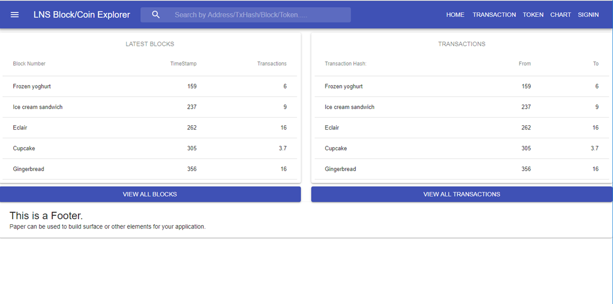

# LNS Standard Coins(ERC20)-Explorer
### Lightweight explorer for ERC20 based Ethereum ERC20 tokens

LNS Standard Coins(ERC20)-Explorer is an explorer built with NodeJS, Express and Geth. It does not require an external database and retrieves all information on the fly from a backend Ethereum node.

## Current Features

Missing a feature? Please request it by creating a new [Issue](https://github.com/heisenbergkim/lns-block-explorer.git).

## Getting started

Supported OS: Ubuntu 16.04/18.04 LTS

Supported Ethereum backend nodes: Parity, Geth

1. Setup a nodejs & npm environment
2. Clone this repository to your local machine: `git clone https://github.com/heisenbergkim/lns-block-explorer.git`
3. Install all dependencies: `npm install`
4. Start the explorer: `npm start`
5. Browse to `http://localhost:4000`

